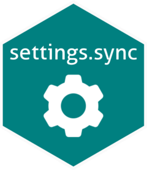

<!-- README.md is generated from README.Rmd. Please edit that file -->

# settings.sync 

<!-- badges: start -->

[](https://github.com/tjpalanca/settings.sync/actions)
[](https://codecov.io/gh/tjpalanca/settings.sync?branch=master)
[](https://lifecycle.r-lib.org/articles/stages.html#stable)

[](https://opensource.org/licenses/MIT)
<!-- badges: end -->

This is an RStudio addin to sync your RStudio settings to a GitHub gist.
This is useful if you have mulitple machines (or cloud instances) with
RStudio server and want to keep the settings in sync.

## Installations

Install this addin from [R Universe](https://tjpalanca.r-universe.dev):

``` r
install.packages("settings.sync", repos = "https://tjpalanca.r-universe.dev")
```

## Usage

Use this package by selecting it from your RStudio menu or running:

``` r
settings.sync::sync_addin()
```
